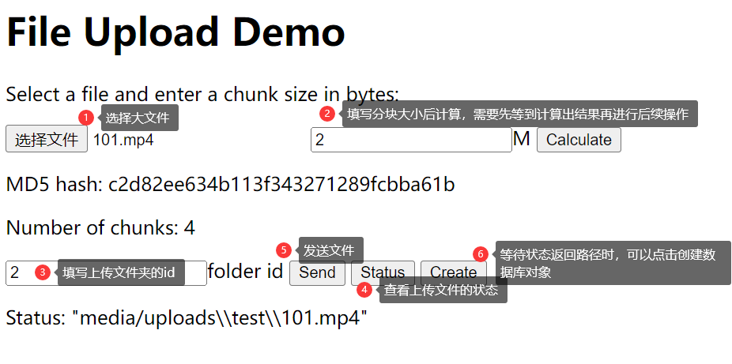

# User Manual

This is a user manual for the **EasyShare** backend project. It will guide you through the process of using the system as a frontend developer or a backend developer.

## API

Run the following command to start the server:
(Please make sure you have installed properly [Install](readme.md#Installation))

```bash
python manage.py runserver --settings=EasyShare.settings.dev
```

Open the browser to `http://host:port/` to see the project apis. You can also use the `http://host:port/admin` to manage the database.

> The `--settings` parameter is used to specify the environment. The default environment is `dev`. You can also use `test` and `prod` to specify the environment.

> You need to login to the system to see the full api list.

## Features

### User System

The user system is a basic system that allows users to register, login, and logout. It also allows users to reset their password.

#### Admin User

The admin user is used for backend developers. The project use default Djando admin user system. You can create a superuser by running the following command:

```bash
python manage.py createsuperuser
```

After running the command, you will be asked to enter a username, email, and password. After that, you can use the username and password to log in to the admin system. The site is located at `http://host:port/admin`.

### File System

The file system allows users to upload files and share them with other users. It also allows users to create folders, upload **large files**, share files in private with others.

#### (Large File) Process Description

> Make sure you have registered and logged in to the system, especially when you want to upload files.

1. **Create Folder**: A Folder is a place where you can share all files in it and share them.
2. **Check File**: Check if the file is already in the system by send the md5 of the file to the server.
3. **Split File**: Split the file into chunks and upload them to the server.
4. **Merge File**: The server will merge the chunks into a complete file and save it to the server when checking the file (step 2).
5. **Create File**: Create a file database instance when upload is success!
    > Make sure you have launch the celery worker to merge the file.

Test File Upload: site `http://host:port/easyshare/large_file`, Step: 
